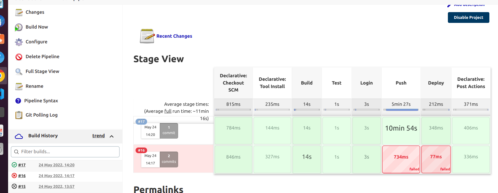
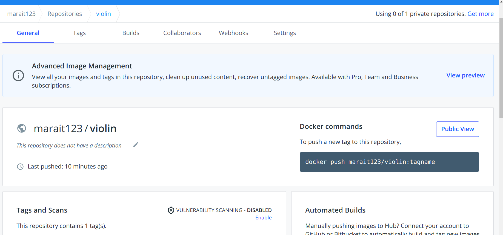
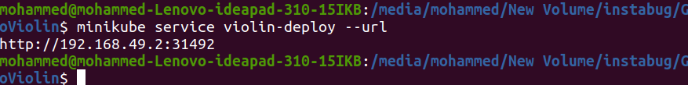
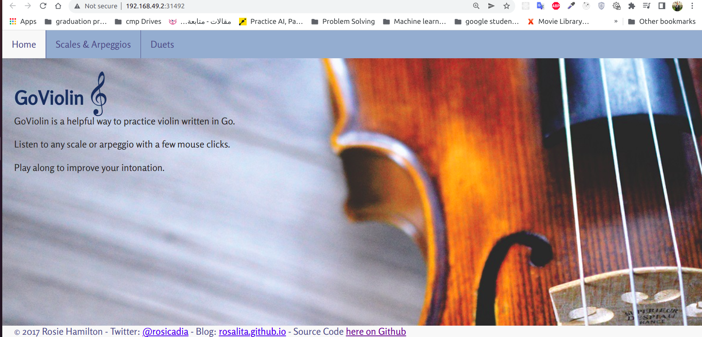

# GoViolin

GoViolin is a web app written in Go that helps with violin practice.

Currently hosted on Heroku at https://go-violin.herokuapp.com/

GoViolin allows practice over both 1 and 2 octaves.

Contains:
* Major Scales
* Harmonic and Melodic Minor scales
* Arpeggios
* A set of two part scale duet melodies by Franz Wohlfahrt

# DEVOPS related files
    |--- Dockerfile # this is the docker file of the app

    |--- Jenkinsfile # the file used by jenkins to create the pipeline , the pipeline is actually on machine is polling scm every 1 minute

    |--- deployemnt.yaml # the file that describes kubernetes deployment scaled to 3 pods

    |--- service.yaml # the file that describes the kubernetes service 

# how to run with docker
- [dockerhub-image-link](https://hub.docker.com/repository/docker/marait123/violin)
- remove the image
`docker rmi violin`
- build the image
`docker build --tag violin .`
- remove the old container
`docker rm violin_cont`
- run the container
`docker run -d -p 8081:8081 --name violin_cont  violin`

- list the containers
`docker ps`

- stop the violin container
`docker stop violin_cont`

- push image to registry
    `docker tag violin marait123/violin`

    `docker push marait123/violin`

# Jenkins part
- the jenkins file has a number of stages the most important are
    1. build stage to build the app and also the image
    2. testing stage to test the app
    3. push stage is where app is push to the registery 
    4. deploy stage is left as place holder but the deployment should go here but I did it alone as written in the requirement you can see it below in kubernetes section

- running of jenkins pipeline

- docker image on dockerhub after running of jenkins pipeline

## common pipeline issues (solution)
- allow jenkins to use docker
`sudo usermod -a -G docker jenkins`

# kubernetes part
## requirements
- minikube to create the cluster and its nodes
- vmware is needed to create the 
- kubectl to interact with the kubernetes master
## how to run the app in kubernetes
- 

## notes
- in case you want to  get the yaml files of
    
    - deployment --> `kubectl get deployment violin-deploy -o yaml > deployment.yaml`
    - service --> `kubectl get service violin-deploy -o yaml > service.yaml`

# how to access the app
- firstly get the app ip

- type the you get in the browser and you should get 
